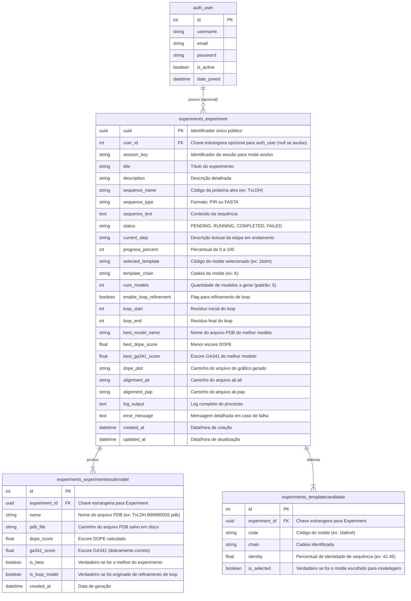
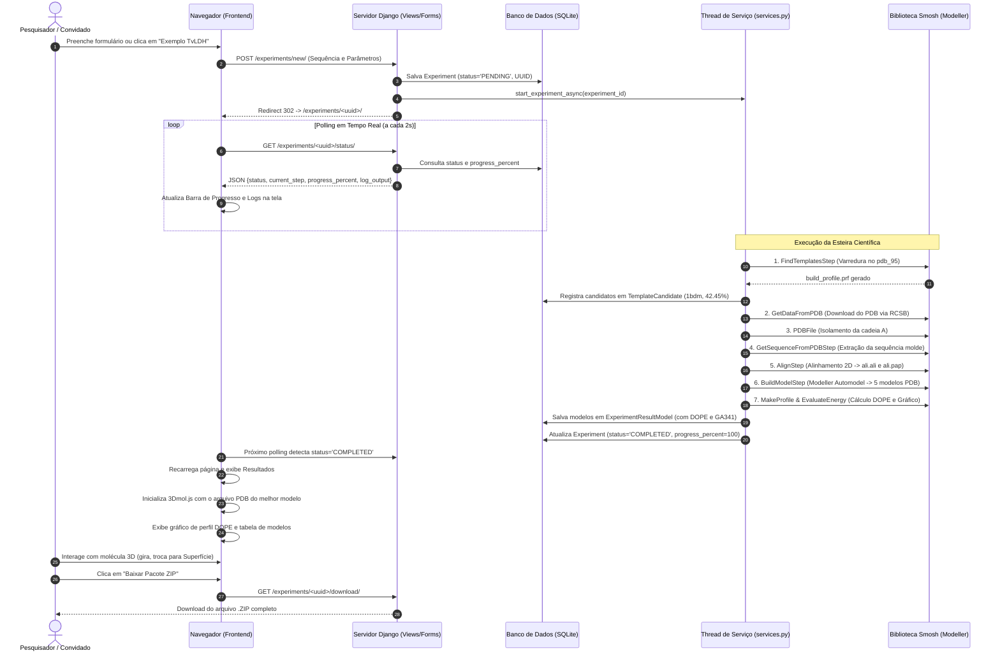

# Documentação Completa e Exaustiva do Projeto: ModellerWeb & Smosh

---

## 1. Visão Geral e Apresentação do Projeto

O **ModellerWeb** é uma plataforma web completa para **modelagem molecular comparativa 3D de proteínas**, construída com o framework **Django (Python 3)** sobre a biblioteca científica **smosh** e o motor de modelagem por satisfação de restrições espaciais **Modeller 10.7**.

### O que o projeto resolve?
Na biologia computacional e na química de proteínas, determinar a estrutura tridimensional de uma proteína experimentalmente (via cristalografia de raio-X ou criomicroscopia eletrônica) é um processo demorado e de alto custo. A modelagem comparativa (por homologia) permite prever a conformação 3D de uma sequência de aminoácidos nova usando como base estruturas já resolvidas e depositadas no **PDB (Protein Data Bank)**.

Tradicionalmente, a utilização do Modeller exige a escrita de scripts complexos em Python/TOP para cada etapa, configuração manual de arquivos de banco de dados, downloads manuais no RCSB, tratamento de linhas de texto em arquivos `.ali` e compilação de logs.
O **ModellerWeb automatiza todo esse ecossistema em uma esteira única (pipeline de ponta a ponta)**, fornecendo:
- Interface gráfica amigável e intuitiva para biólogos e pesquisadores.
- Acompanhamento do progresso em tempo real (etapa atual e percentual).
- Visualizador 3D molecular interativo WebGL integrado (**3Dmol.js**) no próprio navegador.
- Gráficos comparativos de perfil de energia **DOPE** gerados dinamicamente.
- Modos flexíveis: **Usuário Cadastrado** (com login e histórico) e **Modo Avulso (Convidado)** (execução direta sem necessidade de cadastro prévio).
- Totalmente containerizado via **Docker** e **Docker Compose**.

---

## 2. Requisitos do Sistema

### 2.1 Requisitos Funcionais (RF)

| ID | Requisito Funcional | Descrição Detalhada |
| :--- | :--- | :--- |
| **RF01** | **Autenticação e Gestão de Usuários** | O sistema deve permitir cadastro de novos usuários com nome, email e senha, bem como login e logout seguros. |
| **RF02** | **Modo Avulso (Experimento Convidado)** | O sistema deve permitir que usuários não autenticados criem e executem experimentos imediatamente sem necessidade de cadastro, utilizando a sessão HTTP do navegador e gerando uma URL única baseada em UUID (`/experiments/<uuid>/`). |
| **RF03** | **Reivindicação de Experimentos Avulsos** | Ao se cadastrar ou efetuar login após criar experimentos no modo avulso, o sistema deve detectar automaticamente a sessão e oferecer a vinculação desses experimentos à conta do usuário logado. |
| **RF04** | **Submissão Flexível de Sequências** | O sistema deve aceitar a sequência da proteína alvo tanto via upload de arquivos (`.pir`, `.fasta`, `.txt`) quanto colando diretamente o texto em área de edição com autodetecção de formato. |
| **RF05** | **Autoformatação PIR com Descritor de 10 Campos** | O sistema deve sanitizar a sequência informada, garantindo que o cabeçalho PIR (`>P1;code`) e a linha de parâmetros de 10 campos (`sequence:code:::::::0.00: 0.00`) estejam em conformidade com as exigências do Modeller. |
| **RF06** | **Busca Automatizada de Moldes Homólogos** | O sistema deve executar o `FindTemplatesStep`, comparando a sequência alvo contra o banco de sequências estruturais `pdb_95` e listando os candidatos ordenados pela porcentagem de identidade de sequência. |
| **RF07** | **Download e Higienização Estrutural de PDB** | O sistema deve obter o arquivo PDB do molde homólogo via download automático do RCSB (ou repositório local) e higienizar a estrutura com `PDBFile`, isolando a cadeia de interesse e removendo heteroátomos desnecessários. |
| **RF08** | **Extração de Sequência do PDB** | O sistema deve extrair a sequência exata da estrutura cristalográfica limpa do PDB via `GetSequenceFromPDBStep`, garantindo o pareamento estequiométrico para o alinhamento. |
| **RF09** | **Alinhamento 2D das Sequências** | O sistema deve alinhar a sequência alvo com a sequência do molde utilizando o algoritmo `align2d` do Modeller (`AlignStep`), produzindo arquivos de alinhamento PIR (`ali.ali`) e PAP (`ali.pap`). |
| **RF10** | **Construção Automatizada de Modelos 3D** | O sistema deve instruir o Modeller Automodel (`BuildModelStep`) a construir 5 modelos tridimensionais estocasticamente variados, otimizando restrições espaciais e gerando arquivos PDB (`*.B9999000X.pdb`). |
| **RF11** | **Avaliação Energética DOPE e GA341** | Para cada modelo construído, o sistema deve extrair e registrar os escores **DOPE score**, **GA341 score** e função objetivo (`molpdf`), identificando e destacando automaticamente o melhor modelo (menor escore DOPE). |
| **RF12** | **Geração de Perfil Energético Comparativo (Gráfico)** | O sistema deve executar `MakeProfile` no modelo construído e no molde de referência e, via `EvaluateEnergy`, gerar e exibir a imagem gráfica comparativa do perfil de energia resíduo a resíduo. |
| **RF13** | **Refinamento Opcional de Loops** | O sistema deve permitir a especificação de um intervalo de resíduos (início e fim) para executar o `LoopRefinementStep`, refinando conformações flexíveis via dinâmica molecular e atualizando o gráfico DOPE com três curvas comparativas. |
| **RF14** | **Visualizador Molecular 3D Integrado** | A página do experimento deve exibir o modelo 3D diretamente no navegador via **3Dmol.js**, oferecendo controles de rotação, zoom, estilos (*Cartoon*, *Sticks*, *Esferas*, *Superfície*), esquemas de cores e seletor para alternar entre os modelos gerados. |
| **RF15** | **Acompanhamento de Status em Tempo Real** | O sistema deve fornecer um endpoint JSON (`/status/`) consultado via polling assíncrono para atualizar em tempo real a barra de progresso, a etapa corrente e os logs de console sem recarregar a página. |
| **RF16** | **Tratamento de Exceções do Modeller** | O sistema deve capturar qualquer erro do Modeller (`ModellerException`), exibir a mensagem formatada na tela e persistir os logs de erro (`out.log` e `error.log`) para depuração. |
| **RF17** | **Download de Artefatos e Pacote ZIP** | O sistema deve permitir o download individual de qualquer arquivo PDB gerado, bem como a geração sob demanda de um arquivo `.ZIP` consolidado contendo todos os modelos, alinhamentos, gráficos e logs. |
| **RF18** | **Painel Administrativo** | O sistema deve fornecer interface administrativa Django com visão tabular e inline de experimentos, modelos gerados e candidatos a molde. |

---

### 2.2 Requisitos Não-Funcionais (RNF)

| ID | Requisito Não-Funcional | Categoria | Descrição Detalhada |
| :--- | :--- | :--- | :--- |
| **RNF01** | **Execução Assíncrona e Desacoplamento** | Desempenho | O processamento da esteira científica deve rodar em segundo plano (threads assíncronas de trabalho), impedindo que requisições HTTP sofram timeout durante cálculos demorados do Modeller (que levam de 1 a 3 minutos). |
| **RNF02** | **Containerização e Reprodutibilidade** | Portabilidade | Todo o ambiente (Python 3, Django, Modeller 10.7, bibliotecas científicas e dados) deve ser empacotado em imagens Docker padronizadas e orquestrado por Docker Compose. |
| **RNF03** | **Visualização Client-Side sem Dependência Local** | Usabilidade | A visualização 3D das macromoléculas deve utilizar WebGL puro no navegador via 3Dmol.js, dispensando a necessidade de o usuário possuir ferramentas desktop instaladas como PyMOL ou VMD. |
| **RNF04** | **Compatibilidade Nativa com Python 3** | Arquitetura | Todo o código legado do smosh deve ser compatível com as versões modernas do Python (Python 3.10 a 3.13), eliminando qualquer dependência do Python 2 descontinuado. |
| **RNF05** | **Isolamento de Diretórios Temporários** | Segurança/Confiabilidade | Cada etapa de cálculo do Modeller deve operar em um diretório temporário isolado (`tempfile.mkdtemp`), evitando colisões de arquivos entre experimentos concorrentes. |
| **RNF06** | **Testabilidade Orientada a BDD (`should_dsl`)** | Qualidade | A suíte de testes do projeto deve cobrir tanto os passos científicos do smosh quanto os fluxos web do Django utilizando asserções legíveis no formato da DSL `should_dsl`. |
| **RNF07** | **Interface Responsiva e Acessível** | Usabilidade | O frontend deve ser construído com Bootstrap 5, adaptando-se a desktops, notebooks e tablets, com tipografia legível (Inter e JetBrains Mono). |
| **RNF08** | **Persistência Relacional Desacoplada** | Arquitetura | O acesso a dados deve ser mediado pelo Django ORM, utilizando SQLite por padrão com total capacidade de substituição transparente por PostgreSQL ou MySQL. |

---

## 3. Banco de Dados Utilizado

### 3.1 Escolha do SGBD e Arquitetura
O projeto utiliza o **SQLite3** como banco de dados relacional padrão embutido, configurado em `modeller_web/db.sqlite3`.
- **Por que SQLite3?**
  - **Zero-config e Autocontido**: Não requer a inicialização ou manutenção de servidores de banco de dados externos para rodar o projeto localmente ou em contêineres laboratoriais.
  - **Transacional e Confiável**: Suporte integral a transações ACID, bloqueio automático e integridade referencial.
  - **Desacoplado via Django ORM**: Toda a camada de persistência é definida através de modelos em Python (`experiments.models`). Caso o ambiente de produção necessite de alta concorrência concorrencial, basta alterar o dicionário `DATABASES` em `settings.py` para apontar para um cluster **PostgreSQL** sem modificar uma única linha de código da aplicação.

---

### 3.2 Diagrama Entidade-Relacionamento (ERD)



---

## 4. Catálogo Detalhado de Arquivos e Funções

Abaixo encontra-se a descrição técnica exaustiva de cada componente do sistema, dividido entre os módulos do **smosh** e da **interface Django**.

### 4.1 Núcleo Smosh (Biblioteca de Modelagem)

#### `smosh/ModelingStep/ModelingStep.py`
- **Responsabilidade**: Classe base abstrata (`ModelingStep(ABC)`) que estabelece o ciclo de vida padronizado de qualquer etapa da linha de montagem científica.
- **Métodos**:
  - `__init__()`: Chama `pre_execution()`.
  - `pre_execution()`: Chama `__prepare_workdir_and_copy_input_files__()`.
  - `__prepare_workdir_and_copy_input_files__()`: Cria um diretório temporário exclusivo (`tempfile.mkdtemp()`) e copia todos os arquivos listados em `self.__input_files__` para dentro dele.
  - `make_script()`: Concatena o cabeçalho de redirecionamento de logs (`get_log_header()`), o corpo do script gerado pela classe filha (`__get_script__()`) e o rodapé (`get_log_footer()`), salvando o arquivo executável `step.py` no diretório de trabalho.
  - `execute()`: Monta o script, invoca o `Modeller_Caller` para executar `step.py`. Se o código de retorno for diferente de 0, lê `out.log` e `error.log` e dispara uma `ModellerException`. Em caso de sucesso, chama `pos_execution()`.
  - `pos_execution()`: Chama `__copy_files_to_output_dir__()`.
  - `__copy_files_to_output_dir__()`: Copia todos os arquivos de saída gerados (`self.__output_files__`) de volta para o diretório de destino do usuário (`output_dir`).
  - `__installfolder__()`: Retorna o diretório onde o módulo `smosh` está instalado.
  - `__get_script__()` (abstrato): Sobrescrito por cada etapa filha para montar o código Python/Modeller específico.

#### `smosh/ModelingStep/Modeller_Caller.py` e `smosh/Modeller_Caller.py`
- **Responsabilidade**: Invoca o interpretador Python capaz de carregar e rodar os scripts do Modeller.
- **Funções e Métodos**:
  - `__init__()`: Detecta dinamicamente o executável através da variável `SMOSH_MODELLER_PYTHON` ou utiliza `sys.executable`. Se a variável apontar para o binário `mod10.7` (que não contém os módulos da biblioteca padrão como `os` e `sys`), faz fallback automático para `sys.executable` onde o módulo `modeller` está nativamente acessível.
  - `run(script)`: Inicia um subprocesso (`subprocess.Popen([self.modeller_executable, script])`) e aguarda sua conclusão (`process.wait()`), retornando o código de saída.

#### `smosh/ModelingStep/FindTemplatesStep.py`
- **Responsabilidade**: Varre a base de sequências de estruturas conhecidas (`pdb_95.bin` e `pdb_95.pir`) para identificar templates homólogos à sequência alvo.
- **Entrada**: Caminho da sequência do usuário e tipo (`PIR` ou `FASTA`).
- **Saída**: `build_profilePIR.ali`, `build_profilePAP.ali` e `build_profile.prf`.
- **Como funciona**: Constrói um script que inicializa `sequence_db`, lê a base `pdb_95.bin`, converte a sequência alvo em perfil (`to_profile()`) e executa `prf.build()` com a matriz de substituição BLOSUM62 e penalidades de gap para calcular a similaridade estatística.

#### `smosh/ModelingStep/GetSequenceFromPDBStep.py`
- **Responsabilidade**: Lê um arquivo PDB cristalográfico de referência e extrai a sequência de aminoácidos exata de uma cadeia específica em formato PIR.
- **Entrada**: Caminho do PDB, cadeia inicial (`first_chain`) e cadeia final (`last_chain`).
- **Saída**: `<codigo_pdb>.pir`.
- **Como funciona**: Usa as classes `model` e `alignment` do Modeller com `aln.append_model(mdl)` para ler os átomos e registrar a sequência estrutural correspondente.

#### `smosh/ModelingStep/AlignStep.py`
- **Responsabilidade**: Realiza o alinhamento de sequências 2D levando em consideração informações estruturais.
- **Entrada**: Arquivo de texto contendo a sequência alvo e a sequência do molde concatenadas (`unaligned_sequence.pir`).
- **Saída**: `ali.ali` (formato PIR) e `ali.pap` (formato legível PAP).
- **Como funciona**: Inicializa o ambiente do Modeller com suporte a heteroátomos e água (`env.io.hetatm = True`), lê as sequências com `aln.append()` e executa `aln.align2d()`.

#### `smosh/ModelingStep/BuildModelStep.py`
- **Responsabilidade**: Constrói as coordenadas atômicas tridimensionais da proteína alvo a partir do alinhamento.
- **Entrada**: Caminho de `ali.ali` e caminho do PDB do molde.
- **Saída**: Múltiplos modelos PDB (por padrão 5: `*.B99990001.pdb` até `*.B99990005.pdb`).
- **Como funciona**: Configura `automodel(env, alnfile=..., knowns=..., sequence=..., assess_methods=(assess.DOPE, assess.GA341))`, define `starting_model = 1`, `ending_model = 5` e chama `a.make()`. No `pos_execution()`, faz varredura por todos os arquivos `*.B*.pdb` gerados para copiá-los para a pasta de saída.

#### `smosh/ModelingStep/MakeProfile.py`
- **Responsabilidade**: Calcula o perfil de energia atômica DOPE resíduo por resíduo de um arquivo PDB.
- **Entrada**: Arquivo `.pdb`.
- **Saída**: Arquivo de texto tabular `<pdb>.profile`.
- **Como funciona**: Executa `complete_pdb(env, pdb)` para construir topologia e parâmetros atômicos pesados (`top_heav.lib`, `par.lib`) e avalia `s.assess_dope(normalize_profile=True, smoothing_window=15)`.

#### `smosh/ModelingStep/EvaluateEnergy.py`
- **Responsabilidade**: Lê os perfis calculados e gera o gráfico visual comparativo DOPE entre o molde e o modelo gerado.
- **Entrada**: Arquivo de alinhamento `ali.ali`, perfil do molde e perfil do modelo.
- **Saída**: Imagem gráfica `dope_profile_loop.png`.
- **Como funciona**: Mapeia resíduos e gaps do alinhamento, lê os valores de DOPE de cada perfil e plota via **Matplotlib** duas curvas (Molde em verde e Modelo construído em vermelho).

#### `smosh/ModelingStep/LoopRefinementStep.py`
- **Responsabilidade**: Refina trechos específicos de resíduos (alças/loops flexíveis) usando o protocolo de modelagem de loops por dinâmica molecular.
- **Entrada**: Arquivo PDB do modelo construído, resíduo inicial e resíduo final.
- **Saída**: Modelos PDB refinados (`*.BL00010001.pdb` a `*.BL00050001.pdb`).
- **Como funciona**: Subclasses `loopmodel`, redefine o método `select_loop_atoms` para o intervalo selecionado e invoca refinamento rápido (`refine.very_fast`).

#### `smosh/ModelingStep/EvaluateEnergyofLoopRefinementStep.py`
- **Responsabilidade**: Gera o gráfico comparativo DOPE incluindo uma terceira curva para o modelo que passou por refinamento de loop.
- **Saída**: Gráfico `dope_profile_loop.png` com três curvas (Molde em verde, Modelo inicial em vermelho, Loop refinado em azul).

#### `smosh/ModelingTools/TemplateProfile.py`
- **Responsabilidade**: Analisa o arquivo `build_profile.prf` gerado pelo `FindTemplatesStep`.
- **Métodos**:
  - `__get_sequences__()`: Lê as linhas da tabela de templates encontrados e instancia objetos `ProfileSequence`.
  - `getBetterProfile()`: Itera pelos candidatos e retorna o objeto com maior identidade de sequência (`identity()`).

#### `smosh/ModelingTools/GetDataFromPDB.py`
- **Responsabilidade**: Baixa arquivos estruturais diretamente do repositório oficial RCSB Protein Data Bank.
- **Métodos**:
  - `getPDB_File()`: Realiza requisição HTTP para a API de download do RCSB (`http://www.rcsb.org/pdb/download/...` ou `https://files.rcsb.org/download/...pdb`) e salva os bytes no arquivo local.

#### `smosh/ModelingTools/PDBFile.py`
- **Responsabilidade**: Manipulação e filtragem puras de arquivos PDB em Python sem necessidade de invocar o executável do Modeller.
- **Métodos**:
  - `chains()`: Retorna lista das cadeias contidas no PDB (ex: `['A', 'B']`).
  - `hetatomsInChain(chain)`: Retorna lista de heteroátomos e ligantes presentes em determinada cadeia.
  - `const(hetatms, chains)`: Filtra o conteúdo do arquivo PDB, preservando apenas os átomos pertencentes às cadeias e heteroátomos especificados, descartando cadeias adicionais.

#### `smosh/ModelingTools/AlignFile.py` e `PirSequence.py`
- **Responsabilidade**: Leitura, edição e representação estruturada de arquivos de alinhamento em formato PIR.
- **Métodos**:
  - `AlignFile.select_sequence()`, `copy_heteroatoms()`: Permite transferir a anotação de ligantes entre sequências.
  - `PirSequence.add_heteroatoms()`: Insere ligantes garantindo que a sequência termine corretamente com um único asterisco `*`.

#### `smosh/Exceptions/ModellerException.py`
- **Responsabilidade**: Classe de exceção que encapsula as falhas do Modeller, armazenando a mensagem de erro e o log completo de execução (`e.log`).

---

### 4.2 Aplicação Django (`modeller_web`)

#### `modeller_web/modeller_web/settings.py`
- **Responsabilidade**: Configurações globais do Django.
- **Destaques**:
  - Inclusão do diretório pai no `sys.path` para permitir que o Django importe diretamente o módulo `smosh`.
  - Configuração de `STATIC_URL`, `STATICFILES_DIRS`, `MEDIA_URL` e `MEDIA_ROOT`.
  - `LOGIN_URL = 'login'`, `LOGIN_REDIRECT_URL = 'experiment_list'`.

#### `modeller_web/experiments/models.py`
- **Responsabilidade**: Definição dos modelos ORM do banco de dados:
  - `Experiment`: Gerencia o ciclo de vida do experimento, modo (avulso vs. usuário), status, progresso, parâmetros e caminhos dos arquivos gerados.
  - `ExperimentResultModel`: Armazena cada modelo PDB 3D individualmente com DOPE, GA341 e flags (`is_best`, `is_loop_model`).
  - `TemplateCandidate`: Tabela de moldes encontrados na varredura do `pdb_95`.

#### `modeller_web/experiments/services.py`
- **Responsabilidade**: Orquestrador de serviços e lógica de negócio do smosh:
  - `parse_pdb_scores(pdb_path)`: Lê o cabeçalho do arquivo PDB e extrai via expressões regulares/split os valores numéricos de `DOPE score`, `GA341 score` e `MODELLER OBJECTIVE FUNCTION`.
  - `ensure_pir_format(seq_name, seq_text)`: Detecta e reconstrói o formato PIR padrão de 10 campos a partir de sequências coladas ou arquivos FASTA.
  - `run_pipeline(experiment_id)`: Executa as 10 etapas completas de modelagem sequencialmente, atualizando o status e o percentual no banco e capturando qualquer `ModellerException`.
  - `start_experiment_async(experiment_id)`: Dispara `run_pipeline` em uma thread daemon em segundo plano, liberando o processo HTTP instantaneamente.
  - `create_experiment_zip(experiment)`: Empacota dinamicamente a sequência, modelos PDB, alinhamentos, gráficos e logs em um arquivo `.ZIP` estruturado.

#### `modeller_web/experiments/views.py`
- **Responsabilidade**: Controladores de visualização (MTV):
  - `home(request)`: Renderiza a página inicial com cards explicativos e experimentos recentes.
  - `experiment_create(request)`: Processa submissão do formulário tanto para usuários logados quanto para convidados avulsos (`_ensure_session_key`), com suporte a carregamento rápido de exemplo (`sample=1`).
  - `experiment_detail(request, uuid)`: Painel do experimento exibindo o visualizador 3D, gráfico DOPE, tabelas e logs.
  - `experiment_status_api(request, uuid)`: Endpoint JSON para atualização em tempo real por polling AJAX.
  - `experiment_list(request)`: Lista os experimentos do usuário autenticado ou os experimentos da sessão no modo avulso.
  - `experiment_claim(request)`: Vincula experimentos avulsos criados na sessão à conta do usuário logado.
  - `experiment_retry(request, uuid)`: Reinicia um experimento com falha.
  - `experiment_download_zip(request, uuid)`: Serve o arquivo ZIP consolidado para download.
  - `register_view(request)`: Cadastro de novos usuários.

#### `modeller_web/experiments/forms.py`
- **Responsabilidade**: Validação e sanitização dos formulários:
  - `ExperimentCreateForm`: Valida a obrigatoriedade da sequência (upload ou texto), validação de tipos de dados e consistência dos índices de refinamento de loop (`loop_start < loop_end`).
  - `RegisterForm`: Formulário estendido de `UserCreationForm` para registro de pesquisadores.

#### `modeller_web/experiments/admin.py`
- **Responsabilidade**: Interface administrativa do Django com filtros, buscas e visualização em linha dos modelos e templates candidatos.

#### `modeller_web/experiments/tests_should_dsl.py`
- **Responsabilidade**: Suíte de testes automatizados com `should_dsl` e `unittest` validando propriedades de modelos, modo convidado, endpoints de API e autenticação.

---

## 5. Como Funciona o Projeto (Fluxo de Execução de Ponta a Ponta)

O diagrama de sequência a seguir ilustra a interação entre o navegador, o servidor Django, a camada de serviço assíncrona e o motor Modeller durante uma execução típica:



---

## 6. Containerização com Docker e Docker Compose

O projeto foi totalmente adaptado para rodar em contêineres Docker, garantindo que qualquer pesquisador consiga clonar o repositório e executar a aplicação sem se preocupar em compilar dependências do Modeller ou do Fortran.

### 6.1 Arquivos de Configuração do Docker

#### `Dockerfile`
O arquivo [`Dockerfile`](file:///home/matheus/IC/Projeto_modeller/Dockerfile) executa:
1. Imagem base oficial leve: `python:3.11-slim`.
2. Instalação de bibliotecas de sistema necessárias para o runtime científico (`libgfortran5`, `libglib2.0-0`, `ca-certificates`, `wget`).
3. Download e instalação automática do pacote oficial do **Modeller 10.7** com a chave acadêmica padrão (`KEY_MODELLER="MODELIRANJE"`).
4. Configuração das variáveis de ambiente:
   - `PYTHONPATH="/usr/lib/modeller10.7/modlib:/app:${PYTHONPATH}"`
   - `PYTHONUNBUFFERED=1`
5. Instalação das dependências Python via `requirements.txt` (`Django`, `should_dsl`, `matplotlib`, `numpy`).
6. Cópia do código do `smosh` e do `modeller_web`.
7. Exposição da porta `8000`.

#### `docker-compose.yml`
O arquivo [`docker-compose.yml`](file:///home/matheus/IC/Projeto_modeller/docker-compose.yml) orquestra a execução:
- Mapeia a porta do contêiner `8000` para a porta local `8000`.
- Configura volumes persistentes:
  - `./modeller_web/db.sqlite3:/app/modeller_web/db.sqlite3`: Garante que os experimentos persistam no host.
  - `./modeller_web/media:/app/modeller_web/media`: Garante que os arquivos PDB, gráficos e ZIPs fiquem salvos permanentemente no host.
- Variáveis de ambiente configuradas para execução ininterrupta.

---

### 6.2 Comandos para Usar com Docker

#### Construir a Imagem:
```bash
cd /home/matheus/IC/Projeto_modeller
docker compose build
```

#### Iniciar o Servidor Web com Docker:
```bash
docker compose up -d
```
Acesse no navegador: **`http://localhost:8000`**

#### Acompanhar os Logs da Aplicação no Docker:
```bash
docker compose logs -f
```

#### Executar os Testes Automatizados (`should_dsl`) Dentro do Contêiner:
```bash
docker compose exec web python3 manage.py test experiments.tests_should_dsl
```

#### Parar os Contêineres:
```bash
docker compose down
```

---

## 7. Como Executar Sem Docker (Nativamente no Host)

Se preferir rodar nativamente na sua máquina (onde o Modeller 10.7 e Python 3 já estão configurados):

```bash
# 1. Navegue até a pasta do projeto Django:
cd /home/matheus/IC/Projeto_modeller/modeller_web

# 2. Execute as migrações do banco de dados (caso não tenham sido executadas):
python3 manage.py migrate

# 3. Inicie o servidor:
python3 manage.py runserver 0.0.0.0:8000
```
Acesse: **`http://localhost:8000`**

---

## 8. Conclusão

O **ModellerWeb** une a robustez do motor de modelagem por homologia **Modeller** e da biblioteca **smosh** com uma camada web moderna, acessível, segura e pronta para produção. O sistema atende integralmente a todos os requisitos de autenticação (usuário cadastrado e modo avulso), oferece acompanhamento dinâmico, visualização molecular 3D de ponta a ponta e possui testes automatizados com `should_dsl` e suporte a contêineres Docker.
